# 🛡️ Automated Network Intrusion & Anomaly Detection System

An end-to-end MLOps platform that detects network attacks, **continuously monitors
itself for drift, and automatically retrains** — combining **Apache Airflow** (optional
orchestration), **MLflow** (tracking + model registry), **DVC** (data versioning),
PostgreSQL (optional), FastAPI and Streamlit.

> Submission note: this project is shipped so it runs **without Docker** on a single
> laptop. The live `main` branch is configured for a local SQLite database + file-based
> MLflow store out of the box. The containerized stack (Airflow, PostgreSQL, MLflow
> server, dashboard) is the optional production setup — see the Docker Quickstart
> below. The no-Docker path is fully self-contained: `python -m scripts.run_local`.

```mermaid
flowchart LR
    Logs[Network Logs / Traffic Data] --> AF[Airflow]

    subgraph "Daily training pipeline"
        AF --> DV[Data Validation]
        DV --> prep[Preprocessing + Feature Engineering]
        prep --> train[Model Training 5-model zoo]
        train --> ML[MLflow]
        ML --> REG[Model Registry<br/>promotion gate → Production]
    end

    subgraph "Serving + monitoring loop"
        REG --> PRED[Anomaly Detection<br/>FastAPI serving]
        PRED --> MON[Model Monitoring<br/>hourly DAG: PSI · KS · live F1]
        MON --> DRIFT[Drift Detection]
        DRIFT -->|No Drift| keep[Keep current model]
        DRIFT -->|Drift Detected| RETRAIN[Airflow triggers Retraining → v2]
        RETRAIN --> REG
    end

    style REG fill:#1e3a8a,color:#fff,stroke:#3b82f6
    style DRIFT fill:#7f1d1d,color:#fff,stroke:#f87171
    style keep fill:#14532d,color:#fff,stroke:#4ade80
    style RETRAIN fill:#7c2d12,color:#fff,stroke:#fb923c
```



(If your viewer doesn't render Mermaid, the same pipeline is drawn as an ASCII
diagram in `docs/pipeline.md` and cross-referenced from the project layout below.)

## The closed loop (the part that makes this MLOps, not just ML)

1. `network_ids_monitoring` runs **hourly**, pulling fresh "live" traffic.
2. Drift is measured per feature (PSI ≥ 0.20 = drift, KS-test for numerics,
   categorical PSI) and live F1 is compared against the registry champion's
   training F1.
3. If ≥ 20% of monitored features drift **or** live F1 < 0.85, a
   `BranchPythonOperator` routes into `retrain_pipeline`.
4. Retraining runs the same gated pipeline as daily training; the challenger is
   registered **only if** it clears the validation gate (F1 ≥ 0.90, P/R ≥ 0.85)
   **and** beats the champion by ≥ 0.002 F1. Promotion moves the **`champion`**
   alias in the MLflow Model Registry (the modern aliases API — the deprecated
   stages API is not used anywhere).
5. Every decision (promoted or rejected, with reasons) is written to
   `retraining_events` and shown on the dashboard.

## Quickstart (no Docker — runs on a single laptop)

```bash
# 1. Create and activate a venv
python -m venv .venv
.venv/Scripts/activate                       # Linux/mac: source .venv/bin/activate

# 2. Install project dependencies
.venv/Scripts/pip install -r requirements.txt

# 3. Run the full pipeline end-to-end against local SQLite + file MLflow store
python -m scripts.run_local
```

`scripts.run_local` exercises the complete lifecycle in one shot: it generates a
synthetic training batch, runs all five models through the training pipeline,
registers the champion in the MLflow Model Registry (via the `champion` alias),
scores a fresh live batch through the production model, and then detects drift
on shifted traffic so you can see the monitoring verdict. After it finishes:

- MLflow UI: `mlflow ui --backend-store-uri file:./mlruns` — every training run,
  metric, parameter, and the registered model are logged there, and the champion
  alias points at the promoted version.
- Dashboard: `streamlit run dashboard/app.py` — KPIs, threat-type chart, model
  status card (reads the champion via the FastAPI `/model/info` endpoint), drift
  history, and the automatic retraining log.
- API: `uvicorn src.api:app --host 127.0.0.1 --port 8000` — `POST /predict`,
  `GET /model/info`, `GET /drift/latest`. Point the dashboard at it with
  `API_BASE_URL=http://localhost:8000`.

This is the configuration the shipped repository is set up for: local SQLite at
`data/nad_local.db` and an MLflow file store at `./mlruns`. No database, no Docker,
no network dependencies required.

### Live demo with real network traffic (Windows)

The pipeline can score your **actual laptop traffic** instead of synthetic flows —
that's the real-traffic mode this project was built around.

```bash
# One-time Windows setup:
#   1. Install Npcap → https://npcap.com (tick "WinPcap API-compatible Mode")
#   2. Open the terminal as Administrator

python -m scripts.capture --check              # environment diagnostics
python -m scripts.capture --list-interfaces    # find e.g. "Wi-Fi" / "Ethernet"
python -m scripts.capture --window 30          # 30s real capture → score → dashboard
python -m scripts.capture --continuous --interval 60   # run until you stop it
```

Each window aggregates packets into flows (`src/traffic_capture.py::FlowTracker`),
maps them into the **same 16-feature training schema** (KDD-style flags: SF/S0/REJ,
port→service mapping, SYN-spread entropy proxy), and streams them through the
production model via the normal `score_batch()` path — predictions land in the
dashboard under source `capture` (use the Traffic-source slider to view them
separately). Linux/macOS need libpcap; non-admin runs degrade gracefully with
exact fix instructions.

> Note: the shipped model is trained on synthetic data — real traffic will likely
> trigger drift alerts (which is the monitoring loop doing its job). Retrain on
> captured windows to adapt — see below.

### Adapting the model to YOUR real network (pseudo-labeling)

Captured flows are unlabelled, so adaptation uses **self-training**: the current
production model pseudo-labels its own captured traffic, only predictions above
a confidence threshold are kept (default 0.85), and they are blended with fresh
synthetic **anchor** batches so all five attack classes stay represented. The
result runs through the normal promotion gate — the registry only adopts an
adapted model that genuinely beats the champion, and the audit trail records
the pseudo-label share of every adaptation.

```bash
python -m scripts.capture --window 60 --iface "Wi-Fi"   # repeat a few times
python -m scripts.adapt --status                        # captured rows vs needed (3000)
python -m scripts.adapt --run                           # gated adaptation cycle
```

The continuous capture CLI tracks the adaptation pool live
(`adaptation pool 1,240/3,000`) and the monitoring DAG's retrain task uses the
adapted corpus automatically when enough real traffic exists. Once adapted, the
drift reference includes real traffic — so alert storms stop while genuinely
novel behaviour still triggers the loop. Thresholds live in
`config.yaml → adaptation:`.

## Quickstart (Docker — optional production setup)

```bash
cp .env.example .env
docker compose up --build -d
# first boot only: init happens in the airflow-init service automatically
```

| Service | URL | Notes |
|---|---|---|
| Airflow UI | http://localhost:8080 | admin/admin — unpause both DAGs |
| MLflow UI | http://localhost:5000 | experiment `Network-Anomaly-Detection` |
| FastAPI | http://localhost:8000/docs | `POST /predict`, `GET /model/info`, `GET /drift/latest` |
| Streamlit | http://localhost:8501 | NETWORK SECURITY MONITOR dashboard |
| PostgreSQL | localhost:5432 | dbs: `network_ids`, `airflow`, `mlflow` |

Then, in the Airflow UI:

1. Unpause **network_ids_training** and trigger it (trains the 5-model zoo,
   registers the champion as `Production`).
2. Unpause **network_ids_monitoring**. To demo the drift → retrain loop, trigger
   it with:

```bash
docker compose exec airflow-scheduler airflow dags trigger network_ids_monitoring \
  -c '{"day":"attack-wave","drift_profile":{"src_bytes_scale":2.8,"packet_rate_shift":1.8,"attack_rate":0.12}}'
```

The monitor flags the shift, the branch fires, Airflow retrains, MLflow logs v2,
and — if it beats the champion — it is promoted. Watch it land in the
`retraining_events` table and the dashboard's *Automatic Retraining Log*.

> This stack is optional. The repository ships configured for the no-Docker path
> above; the Docker stack is the production-grade arrangement with Airflow,
> PostgreSQL, and a dedicated MLflow server. Airflow's native CLI cannot run on
> Windows (it depends on POSIX `fork`); it is supported here only via Docker or WSL2.

## Model zoo

Compared on every training run (each in its own MLflow run):

| Model | Type | Notes |
|---|---|---|
| Random Forest | supervised | class-weighted, 300 trees |
| XGBoost | supervised | hist, 400 rounds — default candidate |
| Isolation Forest | unsupervised | anomalies → k-means → attack-class mapping |
| One-Class SVM | unsupervised | Nyström kernel approximation for scale |
| Autoencoder | unsupervised | MLP reconstruction error, 99th-pct threshold |

Unsupervised detectors output `normal`/`attack-class` labels via an
anomaly-to-centroid mapper, so all five are comparable with the same metrics
and all five can be deployed through the same serving path.

## Data contract

Flows carry these columns. At runtime the system is **real-traffic-only**:
`scripts/capture.py` turns NIC packets into this exact schema (source
`capture`), and the dashboard/monitoring/adaptation consume only captured
flows. The labelled bootstrap corpus should ideally be real data too — use the
**NSL-KDD ingestion** below (or map NSL-KDD/CIC-IDS2017 columns via
`scripts/ingest --input` / `load_raw_csv`); the synthetic generator remains
only as a fallback bootstrap and post-adaptation class anchors:

### Bootstrap on NSL-KDD (real labelled dataset)

```bash
# 1. Download KDDTrain+.txt (and optionally KDDTest+.txt) from
#    https://www.unb.ca/cic/datasets/nsl-kdd.html
python -m scripts.ingest_nslkdd --train KDDTrain+.txt --test KDDTest+.txt
# -> data/raw/nslkdd_train.csv (+ _test.csv) in our 16-column schema

python -m scripts.validate --input data/raw/nslkdd_train.csv
python -m scripts.train --input data/raw/nslkdd_train.csv --trigger nslkdd-bootstrap
```

The mapper (`src/nslkdd_ingest.py`) folds 70 services into our 7-domain
service column, 11 flags into our 4, groups 30+ attack names into the 5
classes (DoS→ddos, Probe→port_scan, R2L→brute_force, U2R→botnet), derives
`packet_rate`/`bytes_per_packet` (documented proxies — NSL-KDD has no
per-packet data), clips values to the validation-gate ranges, and drops
unknown/ultra-rare classes with a full stats report. Two features have no
NSL-KDD source and are set to neutral constants (`src_port_entropy`,
`connection_duration_std`), noted in the module docstring.

```
duration, src_bytes, dst_bytes, count, srv_count, same_srv_rate,
diff_srv_rate, src_port_entropy, packet_rate, connection_duration_std,
failed_logins, bytes_per_packet,        # numeric
protocol, service, flag,                # categorical
attack_type                             # label: normal|ddos|port_scan|brute_force|botnet
```

Engineered features added at featurize/serving time: `bytes_ratio`,
`src_bytes_log`, `duration_log` (idempotent, recomputed identically offline and
online).

## Configuration

Everything tunable lives in `config/config.yaml`: model zoo + candidate,
promotion-gate thresholds, drift thresholds (PSI warn/drift, KS α, drift share),
split ratios, batch sizes. Environment (via `.env`) controls connections only.

## Data versioning (DVC)

```bash
pip install dvc
dvc init
python -m scripts.ingest --n 40000 --seed dvc-base --out data/raw/train.csv
dvc add data/raw/train.csv data/processed/train.parquet
git add dvc.yaml .gitignore data/raw/train.csv.dvc
dvc repro            # runs the dvc.yaml stage graph
```

`dvc.yaml` defines `ingest → validate → featurize → train` with `models/`,
`reference.parquet` and `data/metrics.json` as outputs. Add a remote
(`dvc remote add -d storage s3://...`) to push datasets.

## Project layout

```
├── airflow/dags/            training + monitoring DAGs
├── config/config.yaml       all pipeline/threshold configuration
├── dashboard/app.py         Streamlit NETWORK SECURITY MONITOR
├── docker/                  Dockerfiles (mlflow, api, dashboard)
├── docs/                    pipeline diagram (Mermaid + ASCII)
├── postgres/init/           creates airflow + mlflow databases
├── scripts/                 CLI entry points (ingest/validate/featurize/train/run_local)
├── src/
│   ├── api.py               FastAPI serving
│   ├── config.py            YAML + env configuration
│   ├── data_ingestion.py    synthetic generator + CSV loader
│   ├── data_validation.py   validation gate
│   ├── db.py                SQLAlchemy models + helpers
│   ├── drift_detection.py   PSI / KS / performance drift
│   ├── feature_engineering.py
│   ├── inference.py         production model loading + batch scoring
│   ├── models.py            model zoo
│   └── training.py          MLflow runs, promotion gate, registry
├── tests/                   pytest suite (validation, features, models, drift, db)
├── dvc.yaml                 data versioning pipeline
└── docker-compose.yml       full stack (optional)
```

## API example

```bash
curl -X POST http://localhost:8000/predict \
  -H "Content-Type: application/json" \
  -d '{"records": [{
        "duration": 0.01, "protocol": "tcp", "service": "http", "flag": "S0",
        "src_bytes": 500000, "dst_bytes": 80, "count": 420, "srv_count": 390,
        "same_srv_rate": 0.98, "diff_srv_rate": 0.01, "src_port_entropy": 1.0,
        "packet_rate": 5000, "connection_duration_std": 0.1,
        "failed_logins": 0, "bytes_per_packet": 1400}],
      "persist": false}'
# → {"prediction": "ddos", "is_anomaly": true, "anomaly_score": 0.97, ...}
```

## Live traffic capture (real packets from your NIC)

The pipeline can score your **actual laptop traffic** instead of synthetic flows:

```bash
# One-time Windows setup:
#   1. Install Npcap -> https://npcap.com (tick 'WinPcap API-compatible Mode')
#   2. Open the terminal as Administrator

python -m scripts.capture --check              # environment diagnostics
python -m scripts.capture --list-interfaces    # find e.g. 'Wi-Fi' / 'Ethernet'
python -m scripts.capture --window 30          # 30s real capture -> score -> dashboard
python -m scripts.capture --continuous --interval 60   # run until Ctrl+C
```

Each window aggregates packets into flows (`src/traffic_capture.py::FlowTracker`),
maps them into the **same 16-feature training schema** (KDD-style flags: SF/S0/REJ,
port→service mapping, SYN-spread entropy proxy), and streams them through the
Production model via the normal `score_batch()` path — predictions land in the
dashboard under source `capture` (use the Traffic-source slider to view them
separately). Linux/macOS need libpcap; non-admin runs degrade gracefully with
exact fix instructions.

> Note: the model is trained on synthetic data — real traffic will likely trigger
> drift alerts (which is the monitoring loop doing its job). Retrain on captured
> windows to adapt — see below.

## Adapting the model to YOUR real network (pseudo-labeling)

Captured flows are unlabelled, so adaptation uses **self-training**: the current
Production model pseudo-labels its own captured traffic, only predictions above
a confidence threshold are kept (default 0.85), and they are blended with fresh
synthetic **anchor** batches so all five attack classes stay represented. The
result runs through the normal promotion gate — the registry only adopts an
adapted model that genuinely beats the champion, and the audit trail records
the pseudo-label share of every adaptation.

```bash
python -m scripts.capture --window 60 --iface "Wi-Fi"   # repeat a few times
python -m scripts.adapt --status                        # captured rows vs needed (3000)
python -m scripts.adapt --run                           # gated adaptation cycle
```

The continuous capture CLI tracks the adaptation pool live
(`adaptation pool 1,240/3,000`) and the monitoring DAG's retrain task uses the
adapted corpus automatically when enough real traffic exists. Once adapted, the
drift reference includes real traffic — so alert storms stop while genuinely
novel behaviour still triggers the loop. Thresholds live in
`config.yaml → adaptation:`.

## Pipeline diagram

This project ships a rendered pipeline diagram at `docs/pipeline.md` (Mermaid
source plus an ASCII fallback so the diagram is readable anywhere, including
printouts and rubrics that don't render Mermaid). The diagram above and that
document show the same flow:

1. Network logs / traffic data enter the system.
2. **Airflow** orchestrates the daily training DAG (`network_ids_training`).
3. Data validation → preprocessing + feature engineering → 5-model training zoo
   → **MLflow** logging → **Model Registry** with a gated promotion that writes a
   `champion` alias.
4. The production model is served by **FastAPI** and consumed by the Streamlit
   **dashboard** and by batch scoring jobs.
5. An hourly monitoring DAG (`network_ids_monitoring`) scores live traffic,
   measures drift (PSI/KS/live F1), and — when drift crosses threshold — triggers
   retraining, which re-enters the registry.

Airflow DAG status and MLflow experiment tables live in their own UIs — link them
here for the demo: Airflow (grid + gantt of the loop) and MLflow (model comparison
table across versions).

## Testing

```bash
.venv/Scripts/python -m pytest tests/ -v
```

Covers the validation gate (schema/range/label/balance), feature-engineering
idempotence and persistence, all five models' learning behaviour, PSI/KS
correctness and verdict flow, and the DB layer.

## Demo story (for presentation)

1. **Day 1:** trigger `network_ids_training` → champion XGBoost v1 (F1 ~0.96).
2. **New traffic:** trigger monitoring with a `drift_profile` (attack wave) →
   dashboard shows drift share jump and "Drift Detected".
3. **Airflow reacts:** branch → retrain → MLflow logs v2 → gate evaluates →
   v2 promoted (or rejected with reasons in `retraining_events`).
4. **Dashboard:** KPIs, threat-type bars, model status card (version, F1, last
   retrained), drift history line chart, retraining log.

Airflow DAG status and MLflow experiment tables live in their own UIs — link
them here for the demo: Airflow (grid + gantt of the loop) and MLflow (model
comparison table across versions).
